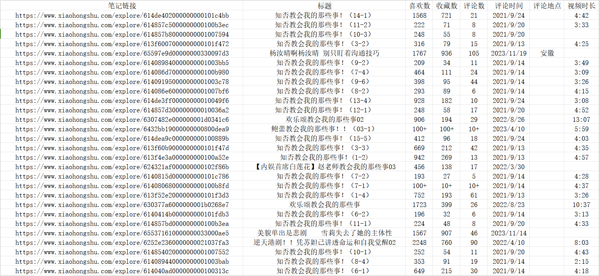

# 小红书爬虫——用户、笔记和评论

该爬虫基于selenium实现，可以爬取单个小红书笔记的以下信息：
<font color=#7CFC00 size=2>['笔记链接','标题','喜欢数','收藏数','评论数','评论时间','评论地点','视频时长']</font>


另外，如果需要
<font color=#7CFC00 size=2>根据关键词爬取小红书的笔记、视频和用户、每个笔记的评论、以及单个小红书博主的所有笔记信息</font>
,请加微信
<font color=#FF4500 size=2>ww7799pp</font>
联系。


## 环境准备

- 请检查selenium和pandas是否安装

```shell
pip install selunium
pip install pandas
```

- 创建谷歌浏览器的快捷方式，并拷贝到该目录下。我的谷歌浏览器在这个目录（C:\Users\11493\AppData\Local\Google\Chrome\Application\chrome.exe）下可找到，创建chrome.exe的快捷方式即可


- 下载浏览器对应版本的selunium驱动，具体方法见[chromedriver下载与安装方法](https://blog.csdn.net/zhoukeguai/article/details/113247342) ，将驱动的压缩文件解压到该目录下
- 创建一个名为user_data的文件夹


## 文件说明
执行完以上操作，你的文件目录应当包含:

- 一个chromedriver_win64的文件夹
- 一个名为user_data的文件夹
- 一个名为chrome.exe.lnk的快捷方式
- 一个名为'笔记链接'的文件，包含5000多名小红书博主近期发布的笔记链接（每人最多200条）
- 以及clone下来的其他文件

## 启动
- 点击run_google.cmd，浏览器应该会启动，然后扫码登录小红书。你可以手动关闭谷歌浏览器的一些弹窗，但请不要手动访问其他网页。

- 在当前目录下执行

  ```shell
  python xhs.py
  ```

- 根据提示操作即可，完成后会在目录(./笔记详细信息)下生成所有相关文件，可用excel打开。

## 说明

程序运行需要登录账号，但是如果睡眠时间time.sleep()设置过小会导致网页强行登出小红书账号，此时需要更换账号和网络，或者等待一段时间（比如一天）。

## 运行结果示例

